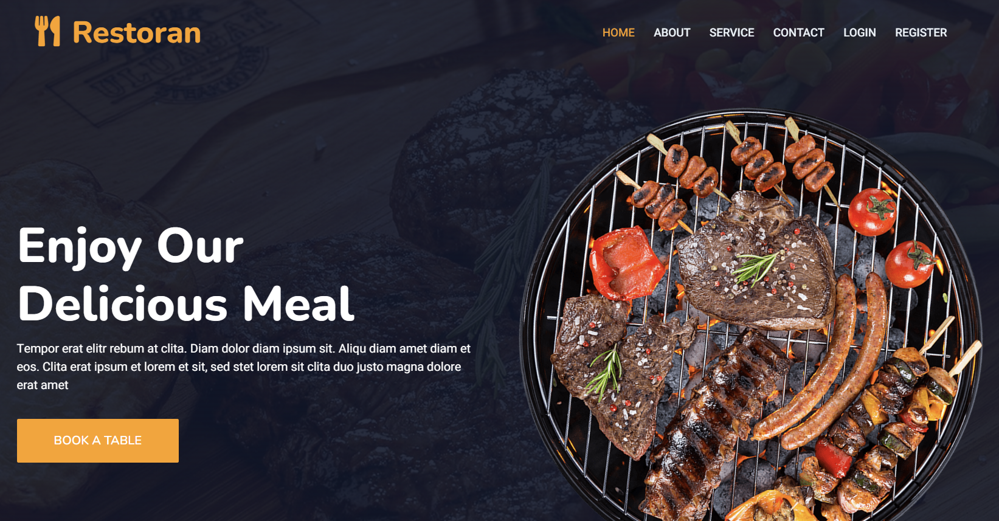
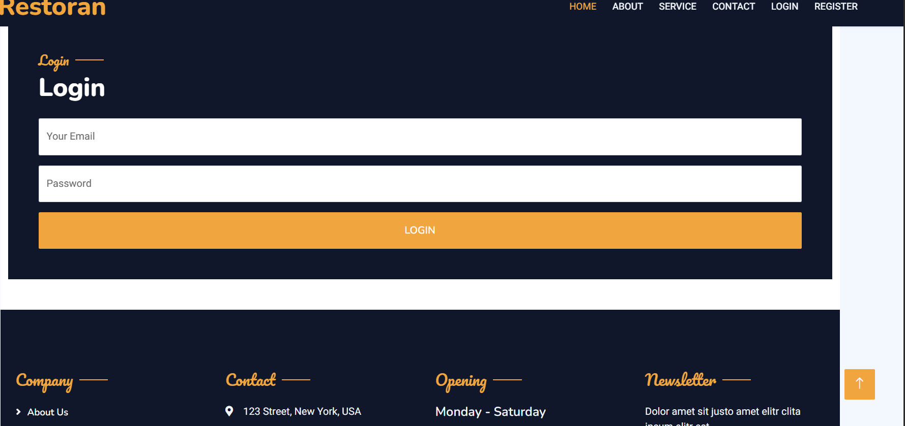
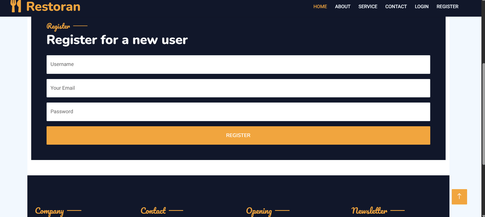
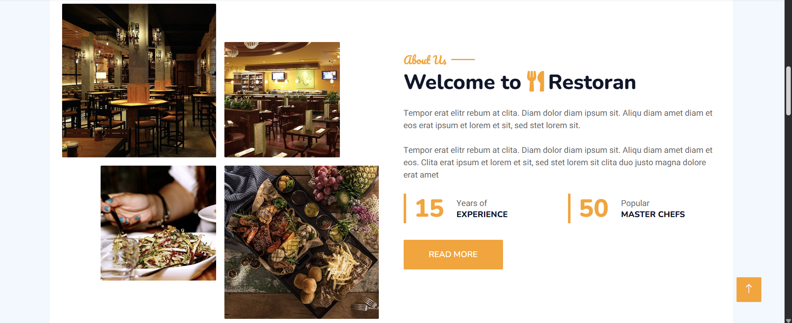
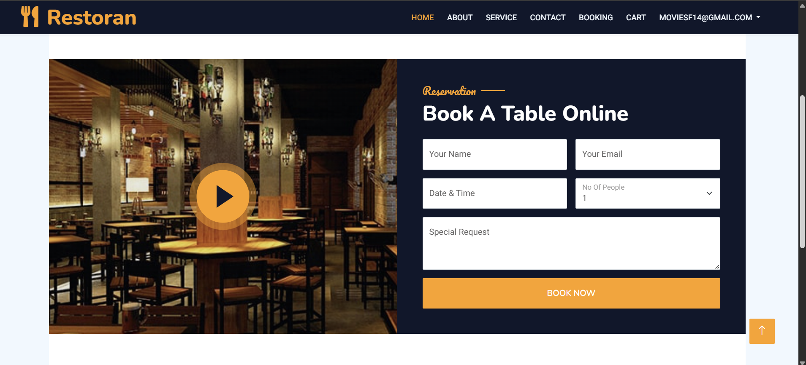
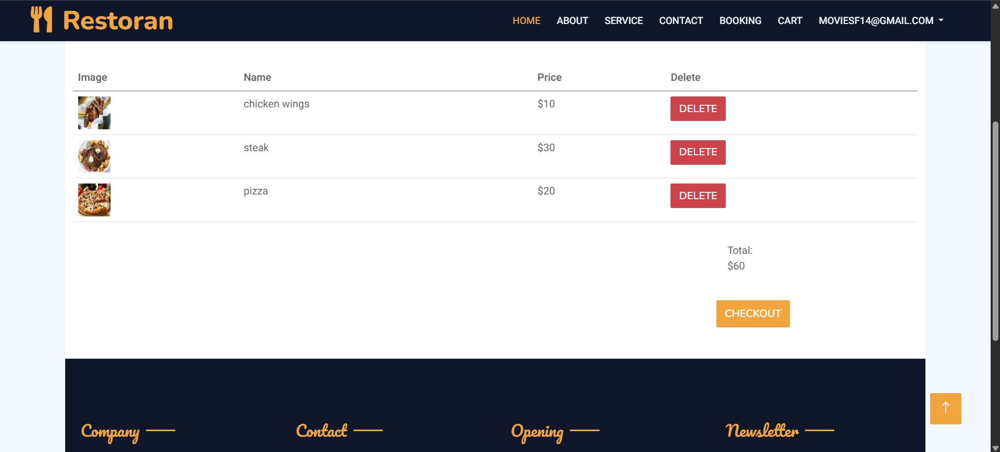
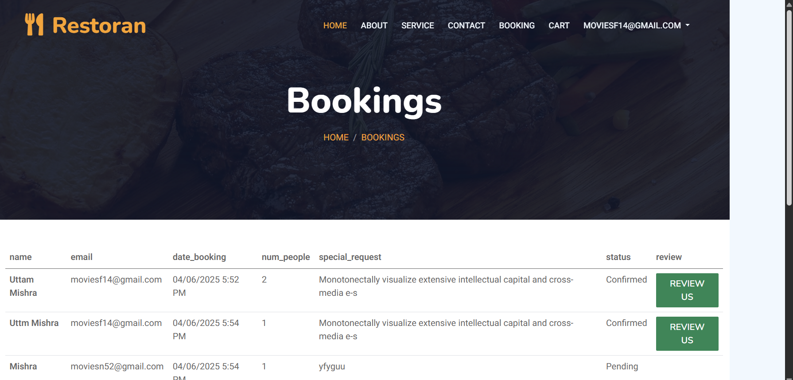
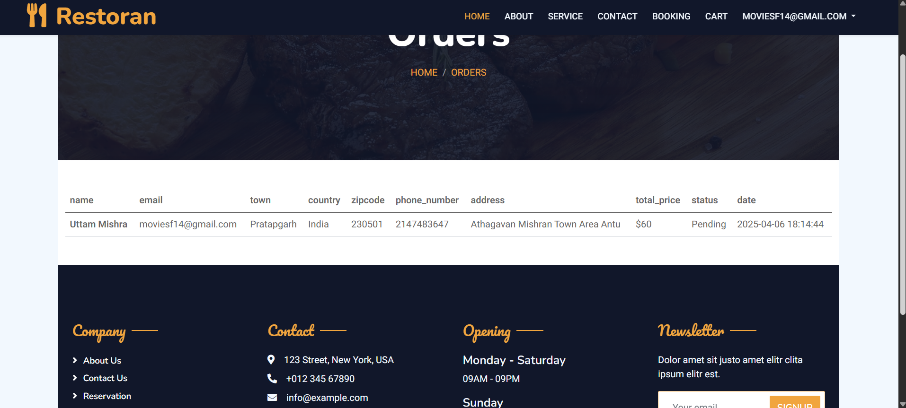

# 🍽️ Project1 - Restaurant Management System

**Project1** is a full-featured web application built to simplify and manage restaurant operations such as **table booking**, **user management**, and **admin control**. Built using **PHP**, **JavaScript**, **SCSS**, and **HTML/CSS**, it provides a responsive interface for both users and administrators.

---

## 🧭 Table of Contents

- [🚀 Features](#-features)
- [🧰 Tech Stack](#-tech-stack)
- [📸 Screenshots](#-screenshots)
- [🛠️ Getting Started](#️-getting-started)
- [🤝 Contributing](#-contributing)
- [📄 License](#-license)
- [📬 Contact](#-contact)

---

## 🚀 Features

- 🔐 **User Authentication**: Secure login & registration system
- 🪑 **Table Booking**: Book a table and manage reservations
- 📬 **Contact Form**: Users can reach out via messaging form
- 🧑‍💼 **Admin Panel**: Manage users, bookings, and view analytics
- 📱 **Responsive Design**: Works seamlessly across devices

---

## 🧰 Tech Stack

| Layer    | Technologies                   |
| -------- | ------------------------------ |
| Frontend | HTML, CSS, SCSS, JavaScript    |
| Backend  | PHP (modular architecture)     |
| Database | MySQL (assumed from structure) |
| Server   | Apache (XAMPP/WAMP compatible) |

      

## 📸 Screenshots

| Page          | Preview                         |
| ------------- | ------------------------------- |
| 🏠 Home       |          |
| 🔐 Login      |        |
| 📝 Register   |  |
| ℹ️ About      |        |
| 📅 Book Table |          |
| 🛍️ Shop       |          |
| 🛒 Cart       |          |
| 🪑 Bookings   |  |
| 📦 Orders     |      |

---

Click to view

🛠️ Getting Started

🧰 Prerequisites

      PHP 7.2+
      
      MySQL / MariaDB
      
      Apache server (XAMPP, WAMP, Laragon)

---
 
3. Set up the database:

         ..Create a new MySQL database (e.g., project1_db).
         
         ..Import the SQL file located in the config/ folder (e.g., database.sql).
         4.Configure the database connection:
         Open config/config.php and set your database credentials:
         define('DB_SERVER', 'localhost');
         define('DB_USERNAME', 'root');
         define('DB_PASSWORD', '');
         define('DB_NAME', 'project1_db');

5.Run the project locally:

      Use XAMPP, WAMP, or any local server.

Place the project folder inside the htdocs/ (XAMPP) directory.

      Access the project at: http://localhost/Project1/

---

🤝 Contributing

      We welcome all contributions!

      Fork the repository

      Create a new branch

      Make your changes

      Submit a pull request 🚀

---

📄 License

This project is licensed under the MIT License.
See the LICENSE file for more information.

---

📬 Contact

      For questions or support, feel free to reach out:

      Developer: [Utsav Mishra]
      Email: [utsavmishraa005@gmail.com]
      GitHub: [https://github.com/bhaktofmahakal]
      linkedIn: [http://linkedin.com/in/utsav-mishra1]
 
---

  
  
  
  

